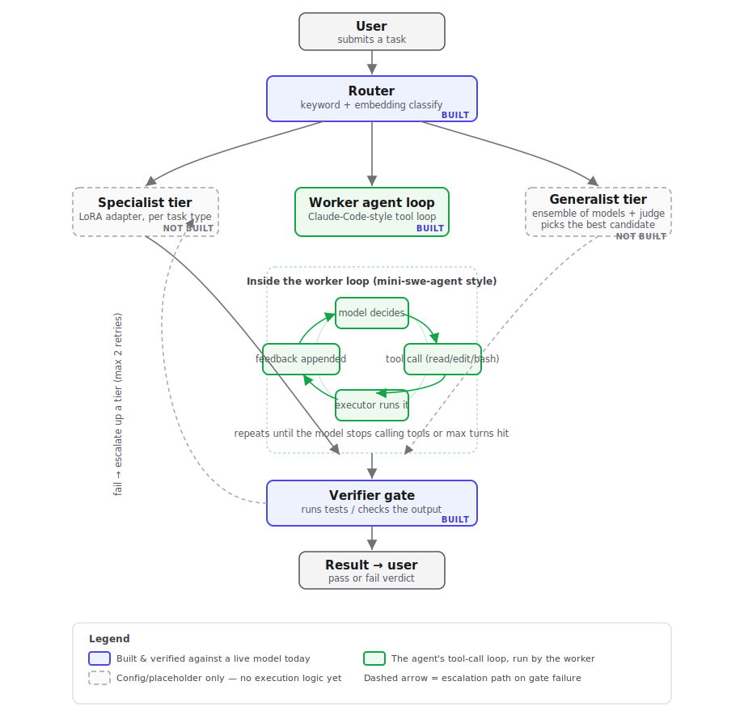

# SAIL — Edge Harness

Local AI orchestration for business workflows: prove that **routed local/open models match frontier cloud models on quality while costing less**, for a real client (first target: DeWitt LLP, a law firm).



## The idea

A business has recurring task types (document extraction, grounded Q&A, memos) and a long tail of novel work. Instead of sending everything to one expensive frontier model:

1. **Router** classifies each incoming task — keyword + embedding similarity with a confidence threshold.
2. **Specialist tier** handles known task types: one base model + a cheap LoRA adapter per task type. Fast and cheap.
3. **Generalist tier** catches the hard tail: an ensemble of mid-size open models generates candidates, a judge picks the best. Expensive, used rarely.
4. Every result passes a **verifier gate** (deterministic test where possible) before it counts, with escalation up a tier on failure.

The pitch is only credible if measured: a **testing/judge script** compares the routed local system against a cloud baseline (Claude) on accuracy, latency, and cost per task, over a committed basket of benchmark tasks.

## Repo layout

| Path | What it is |
|---|---|
| [`docs/`](docs/) | Planning docs exported from the team Google Doc — [plan](docs/plan.md), [routing](docs/routing.md), [testing](docs/testing.md), [harness](docs/harness.md), plus the pipeline diagram |
| [`sail-platform/`](sail-platform/) | The implementation — orchestrator, harness loop, memory, providers, telemetry, CLI. Has its own detailed [README](sail-platform/README.md) |
| [`chat-ui/`](chat-ui/) | Localhost chat interface over the harness — FastAPI SSE backend (`server/`) + React/Vite frontend (`web/`). Watch the router → worker → tool pipeline run live. |
| [`requirements.txt`](requirements.txt) | Python deps for the harness + chat backend (frontend deps are in `chat-ui/web/package.json`) |
| [`implement.md`](implement.md) | Current status per deliverable + prioritized enhancement analysis (start here to pick up work) |
| `PROJECT_PLAN_v2_local-orchestration.md`, `Project_Plan_Jack.pdf` | The original plans the platform was built against |

## Status (2026-07-12)

**Working, verified against a live model** (OpenRouter `google/gemma-4-31b-it`):
- The full harness spine: router → worker agent loop (Claude-Code-style tool calling: read/edit/bash) → verifier gate. The coding smoke task passes end-to-end — the model reads the buggy file, edits it, and the pytest gate goes green (~$0.0009/task).
- Router v0 with 5 task types (coding, extraction, grounded_qa, memo, research) and confidence-based escalation.
- Local memory (fastembed + turbovec), per-role access isolation, cost/latency telemetry.
- **Chat UI** — a white/grey localhost interface that streams the pipeline live (router chip, tool cards, answer, running token + cost meter), with a model picker and paste-a-key flow. See [chat-ui/](chat-ui/).

**Not built yet** (config placeholders only — see [implement.md](implement.md) for the plan):
- Specialist LoRA adapters (training and serving)
- Ensemble + judge generalist execution
- The testing/judge script (local vs. cloud comparison)
- The domain task basket — **the critical-path blocker**; nothing can be measured until it exists

## Quick start

**1. Install** (from the repo root):

```bash
cd sail-platform
python -m venv .venv && source .venv/bin/activate
pip install -r ../requirements.txt        # harness + chat backend deps
```

**2. Add an API key:**

```bash
cp .env.example .env                       # then edit .env and paste your OPENROUTER_API_KEY
```

Get a key at [openrouter.ai/keys](https://openrouter.ai/keys). You can also add one later from the chat UI's model picker. To try the harness with **no key**, use stub mode (below).

**3a. Run the chat UI** (backend + frontend + opens the browser):

```bash
cd ../chat-ui/web && npm install          # one-time: frontend deps
cd .. && bash start.sh                     # http://localhost:5173
```

**3b. Or run a task from the CLI:**

```bash
cd sail-platform
# stub mode — no model server or API key needed
python cli.py task run examples/smoke_coding.yaml --config config/models.dev.yaml

# real inference via OpenRouter (.env loaded)
set -a && source .env && set +a
python cli.py task run examples/smoke_coding.yaml --config config/models.openrouter.yaml
```

More CLI commands (loop, memory search, telemetry report, eval readiness-check) in [sail-platform/README.md](sail-platform/README.md).
