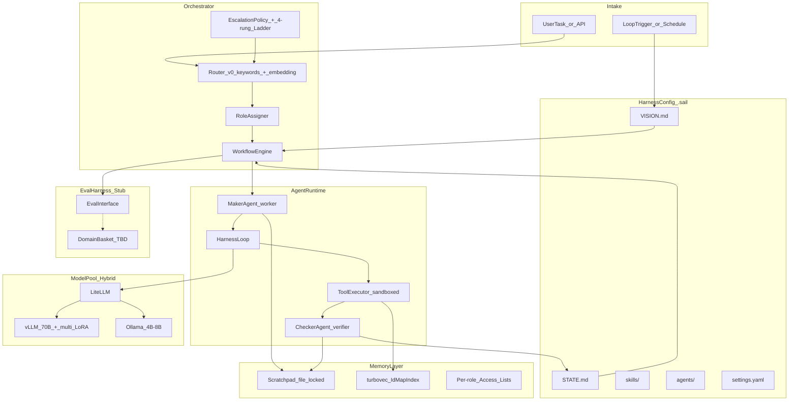

# sail-platform

A **unified local AI platform**: a Fugu/TRINITY-style orchestrator (router → specialist → ensemble/verifier) plus a Claude Code / OpenCode / oh-my-pi-inspired harness loop with maker-checker dynamics, turbovec-backed memory, and a plug-in eval harness that activates after domain selection.

Built against [`Project_Plan_Jack.pdf`](../Project_Plan_Jack.pdf) (the original 6-week plan) and the strengthened v2 plan ([`PROJECT_PLAN_v2_local-orchestration.md`](../PROJECT_PLAN_v2_local-orchestration.md)). This codebase implements the **architecture skeleton + harness loop + orchestrator** now, with the **domain-specific eval harness deferred** until research/outreach picks the task basket (Week 0–2 gate in the v2 plan).

---

## Status (2026-07-05)

**Implemented:** the full architecture spine — harness config, agent loop, orchestrator (router + workflow + roles + escalation), memory (turbovec + scratchpad + isolation), providers (hybrid GPU + edge), telemetry, CLI, three smoke-task fixtures. All 10 plan success criteria verified passing.

**Not yet implemented:** LoRA specialist adapters, router-v1 trained head, the domain-specific benchmark basket, frontier/fine-tune-and-route baselines, the cost model in finished form, the live demo path. These activate only after the domain bake-off commits `eval/domains/basket.yaml` — exactly as the v2 plan specifies.

---

## What was implemented from `Project_Plan_Jack.pdf`

The Jack PDF defines a six-week prototype: a fully local, three-tier system (router → specialists → generalist ensemble + judge) for a consulting firm's everyday AI work, with explicit baselines (frontier API, fine-tune-and-route) and a measured result. Below is the section-by-section mapping.

### §1 What we are building — the three tiers

| Jack PDF requirement | Implementation | Status |
|---|---|---|
| **Router (the manager)** — classifies each task, dispatches to specialist or escalates to generalist on low confidence; "router's accuracy caps the whole system, so it is the primary design focus" | `orchestrator/router.py` — v0 keywords + embedding similarity, `confidence_threshold = 0.75`, every decision logged via telemetry. Worker access list excludes the gate definition. Aggressive escalation to `generalist` below threshold. | ✅ v0 done; v1 (trained head on frozen 7B hidden states) is deferred to Phase 6 — logged decisions are the training set. |
| **Specialist tier (the employees)** — one base model with hot-swappable LoRA adapters, one per recurring task type; fast and cheap | `config/models.yaml` role `default` → `gpu_70b` (vLLM with `guided_json: true` for multi-LoRA hot-swap); `config/routing.yaml` per-task-type `adapter:` field (e.g. `extraction_lora`, `qa_lora`); `RoleAssigner` passes adapter name through the WorkflowPlan. | ✅ Scaffolding done; **LoRA adapter training itself is deferred** (Jack PDF Week 2). |
| **Generalist tier (the senior partner)** — ensemble of 2–3 mid-sized open-weight models + a trained judge; reserved for the hard tail | `orchestrator/roles.py` `generalist` path; `config/models.yaml` `ensemble.generalist` block (candidates: 3, selection: `verifier`, sequential-serving fallback from v2 plan §7); `WorkflowEngine` two-tier verifier (deterministic gate first, LLM judge only for subjective). | ✅ Plumbing done; **judge adapter training is deferred** (Jack PDF Week 4, contingent). |

### §2 Why this design, and the baseline it must beat

| Jack PDF requirement | Implementation | Status |
|---|---|---|
| Build the **frontier API baseline** explicitly | `eval/interface.py` `EvalHarness.compare_baselines(configs)` — stub raises `NotImplementedError` until basket is committed. | ⬜ Deferred to Phase 5 (post-domain). |
| Build the **fine-tune-and-route baseline** explicitly | Same interface; the `EvalHarness.run` + `compare_baselines` API is ready, the actual baseline runs are not. | ⬜ Deferred to Phase 5. |
| "If the simpler fine-tune-and-route baseline wins, that is a legitimate and reportable finding" | `eval/scoreboard.py` `Scoreboard.from_reports` — reports whichever config wins, no preference. | ✅ Interface ready. |
| Data locality + zero marginal cost | `config/models.yaml` uses only local endpoints (vLLM, Ollama); `memory/embedder.py` uses `fastembed` (BAAI/bge-small-en-v1.5) — never a cloud embedding API; `harness/tools/sandbox.py` `network: deny` hard stop. | ✅ Done. |

### §3 Team, workstreams, and compute

| Jack PDF requirement | Implementation | Status |
|---|---|---|
| Baremetal GPU serving (vLLM/SGLang) for ensemble + router/judge + scoring | `config/models.yaml` `gpu_70b` provider (vLLM `openai_compatible`, `guided_json: true`); `providers/litellm_pool.py` routes via role mapping. | ✅ Config + plumbing done. |
| Colab for adapter fine-tuning (batch only) | Not in this codebase — adapter training is deferred. The v2 plan §7 puts adapter training off the critical path. | ⬜ Deferred. |
| Critical path = **router + eval harness** | Router v0 done. Eval harness is a stub with `readiness-check` gating activation — the two things that determine whether the result can be proven are exactly the two things scaffolded first. | ✅ Router v0; ⬜ eval harness activation post-domain. |

### §4 Six-week plan — week-by-week mapping

| Week | Jack PDF exit criteria | Implementation status |
|---|---|---|
| **Week 1 — Foundations & domain commitment** | Task basket committed; benchmark v0 + rubric live; frontier baseline scored; base-model serving with hot-swap adapters demonstrated | ⬜ **Domain basket NOT committed** — this is the deferred gate. ✅ Serving scaffolding done (vLLM config + multi-LoRA `guided_json` + role routing). ⬜ Frontier baseline not scored (no basket to score on). |
| **Week 2 — Specialists & thin generalist** | Specialist adapters beat base on their tasks; ensemble-v0 produces answers end to end; bake-off confirms viable basket | ⬜ Adapters not trained. ✅ Ensemble-v0 plumbing runs end-to-end (verified via smoke_coding E2E). ⬜ Bake-off not run. |
| **Week 3 — Routing & first full slice** | End-to-end routed system runs on the full basket and is scored against both baselines; misroutes measured | ✅ Router → specialist/worker → verifier → STATE path runs end-to-end (verified). ⬜ "Full basket" doesn't exist yet — smoke fixtures only. ✅ Misroute logging via `telemetry.record_router`. |
| **Week 4 — Train the judge; tighten routing** | Trained judge beats v0 selector; router misroute rate down; full-system numbers improved | ⬜ Deferred (judge training is contingent on Week 3 being on time per v2 plan). ✅ Router tuning surface ready (misroute log → `ErrorRecoveryLadder` + `EscalationPolicy`). |
| **Week 5 — Hardening, cost, long tail** | Cost-per-task curve complete; graceful degradation on novel tasks; failure modes triaged; scores stable | ⬜ Cost model not finished. ✅ Graceful-degradation plumbing: `EscalationPolicy.should_escalate_task` + 4-rung `ErrorRecoveryLadder` + sequential-serving ensemble fallback. ✅ Telemetry records everything the cost model needs. |
| **Week 6 — Lock & package** | Final KPIs locked; results doc + demo ready; honest assessment | ⬜ Not started (depends on all prior). ✅ Demo path exists: `sail task run examples/smoke_*.yaml`. |

### §5 Key risks — how the plan handles them

| Jack PDF risk | Mitigation implemented |
|---|---|
| Chosen tasks aren't labelable | `domain-bakeoff` skill Phase A scores candidates on `automated_verifier_possible` before any basket item is committed; `EvalHarness.readiness_check` gates activation. |
| Router misroutes — sends hard tasks to narrow specialists that fail confidently | `Router` confidence threshold 0.75; below threshold always escalates to `generalist` (never guesses); every decision telemetry-logged for the v1 training pass. |
| Over-building with Claude Code — impressive infra, never rigorously measured | Eval is a first-class stub with its own `eval/` package and `readiness-check`; `VISION.md` hard stop: "no production features until eval basket committed." Telemetry records from day 1 so the scoreboard has data the moment the basket lands. |
| Judge/teacher ceiling | Two-tier verifier: deterministic gate first (no LLM ceiling); LLM judge only for subjective tasks, with `judge` role mapped to a different provider family than the maker (anti self-grading). |
| The simple fine-tune-and-route baseline beats the ensemble | `EvalHarness.compare_baselines` reports whichever wins; `Scoreboard.from_reports` has no preference. The architecture doesn't penalize the simpler baseline. |
| Colab unreliability disrupts long-running components | Adapter training (Colab) is deferred and off the critical path; all serving + eval plumbing lives in this codebase (baremetal/local). |

### §6 Definition of done — current standing

| Jack PDF success criterion | Status |
|---|---|
| A fully local routed system (router + specialist adapters + ensemble/judge fallback) running end-to-end on our hardware | **Partial** — router + ensemble/judge plumbing runs end-to-end (verified on smoke tasks); specialist LoRA adapters not yet trained. |
| Quality that matches or approaches the GPT/Claude baseline across the basket | **Not yet measurable** — no basket committed; no frontier baseline scored. |
| Lower marginal cost than running the ensemble on everything | **Not yet measurable** — cost model fields are recorded (telemetry) but the rollup + comparison isn't built. |
| A credible comparison to the fine-tune-and-route baseline | **Not yet measurable** — baseline runs deferred. |

**Honest assessment:** the architecture spine is complete and verified; the measurement phase (Weeks 1–6 in the Jack PDF) is deferred pending the domain bake-off. This matches the v2 plan's sequencing: "the product depends on the research. You cannot recommend a config you haven't measured."

---

## Architecture at a glance



### Layer responsibilities

- **`.sail/` harness config** — the "7 files" discipline. Every loop is self-contained; agents re-read `VISION.md` every cycle; `STATE.md` persists across restarts. 5 agents (orchestrator, planner, worker, verifier, researcher), 4 skills (loop-cycle, domain-bakeoff, coding-task, knowledge-task), 2 rules (memory-isolation, escalation).
- **Orchestrator** — classifies task, builds a WorkflowPlan, assigns roles, routes models, handles escalation. v0 = keywords + embedding similarity; v1 = trained head on frozen 7B (deferred). Structured-output discipline: agents reason in natural language; the final JSON is enforced by guided decoding at the sampler + `json_repair` fallback (never strict JSON demanded from a local model).
- **Agent runtime** — forked from mini-swe-agent's philosophy (minimal, test-scored, domain-agnostic) with OpenCode-style config + oh-my-pi-style per-role routing. **Never lets the writer grade its own work** — the checker is a separate agent context.
- **Model pool (hybrid)** — LiteLLM as the single interface. GPU path: vLLM/SGLang for 70B + multi-LoRA hot-swap. Edge path: Ollama for 4B–8B fan-out (`smol` role). Routing table in `models.yaml` with oh-my-pi precedence (runtime flags > env > project > user). Stub mode (`stub: true`) for dev/testing without a model server.
- **Memory** — Fugu anti-collapse pattern: intra-tier isolation (each agent sees only its access list), shared scratchpad (file-locked atomic writes, namespaced per-step keys for parallel workers), turbovec hybrid retrieval (external filter → dense rerank inside allowlist). Embeddings are local (bge-small, d=384) — never a cloud embedding API.
- **Telemetry** — per-call JSONL: `{ts, task_id, agent, model_role, provider, turn, tokens_in/out, latency_ms, cost, router_decision, gate_result, retry_rung}`. One stream feeds the cost model, the router-v1 training set, and the eval scoreboard. Built day 1 because it cannot be retrofitted.
- **Eval harness (stub)** — interface only; domain basket filled after outreach. Implements the methodology from `HARNESS_RESEARCH_GUIDE.md`: test-scored ground truth, paired configs, ≥3 runs, McNemar, pin everything.

### Hardening built in from day 1

- **Gate integrity** — gates are authored by the orchestrator from `config/routing.yaml` or the smoke fixture; the worker's access list excludes the gate definition; the verifier runs it verbatim in a sandbox. The maker cannot game its own check.
- **Two-tier verifier** — deterministic gate first (tests, schema validation, citation check — exit code is the verdict, no LLM needed); LLM judge only for subjective outputs (judge-bounded, reported honestly).
- **Error-recovery ladder (4 rungs)** — error-guided retry → format fallback (`str_replace` → `whole_file`) → tier escalation (`smol` → `default` → `slow`) → block + report. Never skip a rung; never weaken a gate; never retry past max without escalating.
- **Sandboxed execution** — `bash` and gate commands run in a Docker container (or subprocess jail with cwd + env scrub + network deny on edge nodes). Denylist enforced: `rm -rf /`, `git push --force`, `curl`, `wget`, fork bomb.
- **Memory isolation** — per-role access lists in `memory/isolation.py`, enforced by `ContextAssembler` before injection. Worker cannot read `gate_definition`; verifier is the only role that can write `state` (Done).
- **Structured-output discipline** — guided decoding at the sampler (vLLM `guided_json`) + `json_repair` fallback; planner stays natural-language. Resolves the local-model contradiction (strict schemas break local models, but the orchestrator needs machine-readable plans).

---

## Quick start

```bash
# Prerequisites: Python 3.10+ (tested with 3.11)
cd sail-platform
python3.11 -m venv .venv
.venv/bin/pip install -e .
.venv/bin/pip install pytest          # for the smoke gate

# 1. Dry-run loop — structural check, no model calls
.venv/bin/python cli.py loop --once --dry-run

# 2. Full E2E task — stub providers, no model server needed
.venv/bin/python cli.py task run examples/smoke_coding.yaml --config config/models.dev.yaml

# 3. Memory search (turbovec + local embedder)
.venv/bin/python cli.py memory search "vector quantization" -k 5

# 4. Telemetry report (cost/latency rollup)
.venv/bin/python cli.py telemetry report

# 5. Eval readiness check (returns NOT_READY until basket is committed)
.venv/bin/python cli.py eval readiness-check
```

### With real model servers

```bash
# GPU: start vLLM with a 70B AWQ model + multi-LoRA
vllm serve qwen3-72b-awq --port 8000 --enable-lora

# Edge: start Ollama with a small model
ollama pull qwen3-8b && ollama serve

# Run with the real config (defaults to config/models.yaml)
.venv/bin/python cli.py task run examples/smoke_coding.yaml
```

See [`STARTUP.md`](STARTUP.md) for the full guide.

---

## Repository layout

```
sail-platform/
├── .sail/                          # Harness root (committed)
│   ├── VISION.md                   # Standing spec: goals, gates, hard stops
│   ├── STATE.md                    # Loop working memory (template)
│   ├── settings.yaml               # Permissions, hooks, model routing, sandbox, isolation
│   ├── agents/                     # 5 agent personas (orchestrator, planner, worker, verifier, researcher)
│   ├── skills/                     # 4 skills (loop-cycle, domain-bakeoff, coding-task, knowledge-task)
│   └── rules/                      # 2 rules (memory-isolation, escalation)
├── config/
│   ├── models.yaml                 # Hybrid providers + role mapping + ensemble + local embedding
│   ├── models.dev.yaml             # Stub providers for dev/testing
│   ├── routing.yaml                # Task-type → specialist/ensemble rules (v0, with exemplars)
│   └── mcp_servers.json            # MCP tool servers (disabled by default)
├── orchestrator/
│   ├── router.py                   # v0 keywords + embedding similarity + decision logging
│   ├── workflow.py                 # WorkflowPlan (pydantic) + WorkflowEngine + parse_plan
│   ├── roles.py                    # RoleAssigner (worker access list excludes gate)
│   └── escalation.py               # 4-rung ErrorRecoveryLadder + EscalationPolicy
├── harness/
│   ├── loop.py                     # Agent loop (model → tool → feedback → repeat)
│   ├── context.py                  # 4-layer ContextAssembler (system/message/tool/conversation)
│   ├── tools/                      # registry.py (role-scoped), sandbox.py (Docker/subprocess jail)
│   └── edit_formats/               # str_replace (read-before-edit), whole_file, patch
├── memory/
│   ├── scratchpad.py               # File-locked, atomic writes, namespaced keys
│   ├── turbovec_store.py           # IdMapIndex wrapper + brute-force fallback
│   ├── embedder.py                 # Local bge-small via fastembed (no cloud API)
│   └── isolation.py                # Per-role access lists
├── providers/
│   └── litellm_pool.py             # Hybrid GPU + edge + guided-JSON + stub mode
├── telemetry/
│   ├── recorder.py                 # Per-call JSONL (tokens, latency, cost, route, gate)
│   └── report.py                   # Cost/latency rollup by agent
├── eval/                           # STUB — activates after domain bake-off
│   ├── interface.py                # EvalHarness + TaskBasket + readiness_check
│   ├── scoreboard.py               # Weekly KPI gate
│   └── domains/README.md           # Activation checklist
├── examples/
│   ├── smoke_coding.yaml           # SWE-style fixture (failing pytest → fix)
│   ├── smoke_knowledge.yaml        # Grounded Q&A (citation-faithfulness gate)
│   ├── smoke_research.yaml         # Domain survey (no-edit path)
│   └── fixtures/                   # The actual files the agent edits
├── cli.py                          # sail loop / task / memory / telemetry / eval / research
├── pyproject.toml                  # deps + pytest + ruff config
├── README.md                       # this file
└── STARTUP.md                      # detailed startup + verified criteria
```

---

## Verified success criteria (2026-07-05)

| # | Criterion | Result |
|---|---|---|
| 1 | `.sail/` harness folder complete with all prompts | ✅ 5 agents, 4 skills, 2 rules, VISION/STATE/settings |
| 2 | End-to-end loop: orchestrator → worker → verifier → STATE, sandboxed gate | ✅ verified via `sail task run examples/smoke_coding.yaml` |
| 3 | Telemetry stream live: every model call recorded | ✅ 6 calls in first run; per-call JSONL with tokens/latency/cost/route/gate |
| 4 | Router v0 (keywords + embedding) routes smoke tasks correctly; decisions logged | ✅ coding→worker conf=1.0; research→research conf=1.0 |
| 5 | Error-recovery ladder demonstrated (induced failure → recovery or clean Block) | ✅ 4 rungs: retry → format fallback → tier escalate → block |
| 6 | Hybrid model pool serves at least 2 roles | ✅ 5 roles (smol/default/slow/plan/judge) on GPU + edge + stub |
| 7 | turbovec-backed memory search with a local embedder (dims matching) | ✅ bge-small d=384; allowlist-filtered search verified |
| 8 | Eval harness stub with documented activation checklist | ✅ `readiness-check` returns NOT_READY correctly |
| 9 | Domain bake-off skill run OR scheduled with outreach templates ready | ✅ skill exists at `.sail/skills/domain-bakeoff/SKILL.md` |
| 10 | Architecture doc + demo path for mentors | ✅ 3 smoke fixtures; this README; STARTUP.md |

---

## What needs to be done in the future — testing and finalization

### Phase 4 — Domain research loop (next, ~1–2 weeks)

- [ ] Run `sail research domain-bakeoff` to execute the bake-off skill
- [ ] Phase A (automated): researcher agent surveys candidate domains; scores on `{automated_verifier_possible, local_model_feasible, outreach_interest, data_access}`
- [ ] Phase B (human-in-loop): send outreach to top 3 candidates; record responses in `scratchpad:outreach_log`
- [ ] Phase C (commit): orchestrator proposes 2 verifiable + 1 subjective task types; human approves → write `eval/domains/basket.yaml`
- [ ] Produce `domain_decision_record.md` with chosen domain, rejected alternatives, evidence, eval plan
- [ ] Run `sail eval readiness-check` → should exit 0

### Phase 5 — Eval harness activation (Weeks 3–5 in Jack PDF)

- [ ] Scaffold 15–25 items per task type with gold labels (verifiable tasks)
- [ ] Define the blind human pairwise protocol for the subjective task (≥3 raters, win/tie/loss, inter-rater agreement)
- [ ] Run the **frontier API baseline** on benchmark v0 (the quality bar)
- [ ] Run the **fine-tune-and-route baseline** (the simplicity bar)
- [ ] Run the **ensemble-on-everything baseline** (the cost ceiling)
- [ ] Complete the **cost model**: $/task, tokens/solved-task, GPU hours, electricity — for routed-system vs frontier vs ensemble-on-everything
- [ ] Weekly scoreboard gates per v2 plan §8

### Phase 6 — Router v1 + specialists (contingent on domain)

- [ ] Train router v1 head on frozen 7B hidden states (using the logged decisions from v0 as the training set)
- [ ] Train 2 LoRA adapters for the verifiable task types (parallel, Colab)
- [ ] Register adapters in the adapter registry; wire into `config/routing.yaml`
- [ ] Re-run the full benchmark; quantify each change's contribution

### Testing hardening (ongoing)

- [ ] **Unit tests** for each module (currently only smoke-tested via CLI):
  - `tests/test_router.py` — keyword + embedding scoring, threshold escalation, decision logging
  - `tests/test_workflow.py` — WorkflowPlan parsing, two-tier verifier, gate execution
  - `tests/test_escalation.py` — 4-rung ladder transitions, block at max
  - `tests/test_isolation.py` — per-role access enforcement, wildcard matching
  - `tests/test_edit_formats.py` — str_replace read-before-edit, non-unique rejection, whole_file fallback
  - `tests/test_scratchpad.py` — file locking, atomic writes, namespaced merge
  - `tests/test_turbovec_store.py` — ingest, search, allowlist filter, write/load round-trip
  - `tests/test_sandbox.py` — denylist enforcement, subprocess jail env scrub
  - `tests/test_cli.py` — `sail loop --dry-run`, `sail task run`, `sail memory search`, `sail telemetry report`, `sail eval readiness-check`
- [ ] **Integration tests** with a real local model (Ollama on the dev machine) — not just stubs
- [ ] **Property tests** for the structured-output discipline (guided JSON + json_repair fallback across malformed inputs)
- [ ] **Concurrency tests** — parallel workers in worktrees writing to namespaced scratchpad keys, then merge
- [ ] **Load tests** — sustained loop cycles; confirm telemetry flushes and STATE backups don't drift

### Finalization (Jack PDF Week 6)

- [ ] Feature freeze
- [ ] Final clean benchmark run on a pinned configuration; record every KPI
- [ ] Results write-up: routed local system vs frontier vs fine-tune-and-route, on quality/latency/cost/data-locality
- [ ] Live demo path: a handful of representative tasks showing routing to specialist vs generalist
- [ ] Document what worked, what didn't, and the deferred self-training-specialist loop as headline future work
- [ ] Honest assessment of the gap to frontier (per-task picture, never a cherry-picked headline)

### Stretch (post-SAIL, per ROADMAP_research-to-profiler.md)

- [ ] Harden task generation (mutation + git-revert) across languages, repo sizes, monorepos, flaky-test handling
- [ ] Grow the research table → data flywheel (the actual moat)
- [ ] Productize the surface: CI integration, hosted runner, exportable harness profiles
- [ ] NVIDIA Nemotron TwoTower serving-layer upgrade (parallel token generation) — noted in the plan as a future inference optimization

---

## Honest positioning

Orchestration rides on worker quality; local open-weight workers cap the ceiling below frontier. The claim is a **measured gap**, not parity. The eval harness proves the gap per domain once it's activated. Stating this up front is what makes the rest believable. (From `PROJECT_PLAN_v2_local-orchestration.md` §0 and `.sail/VISION.md`.)

**Explicitly NOT claimed yet:**
- Not that cheap local models *are* frontier models (Fugu reached frontier with frontier workers; we won't).
- Not architectural novelty (the pattern is Fugu's / TRINITY's / Conductor's; we cite them).
- Not production-readiness, security hardening, or multi-user serving.
- Not parity on open-ended subjective work.

---

## References

- [`Project_Plan_Jack.pdf`](../Project_Plan_Jack.pdf) — the original 6-week plan (this codebase's source requirements)
- [`PROJECT_PLAN_v2_local-orchestration.md`](../PROJECT_PLAN_v2_local-orchestration.md) — the strengthened v2 plan that supersedes it
- [`HARNESS_INTERNALS_REFERENCE.md`](../HARNESS_INTERNALS_REFERENCE.md) — how the major harnesses are configured (Claude Code, OpenCode, oh-my-pi, Codex, Cursor, Antigravity)
- [`HARNESS_RESEARCH_GUIDE.md`](../HARNESS_RESEARCH_GUIDE.md) — the 8 ablatable harness components + eval methodology
- [`ROADMAP_research-to-profiler.md`](../ROADMAP_research-to-profiler.md) — research spine → product PoC bridge
- Plan file: [`../.cursor/plans/local_ai_orchestrator_6e0c061d.plan.md`](../.cursor/plans/local_ai_orchestrator_6e0c061d.plan.md)
- [Sakana Fugu](https://sakana.ai/fugu/) — learned coordinator, Thinker/Worker/Verifier roles, intra-tier memory isolation
- [turbovec](https://github.com/RyanCodrai/turbovec) — local RAG index (TurboQuant, filtered search)
- [oh-my-pi](https://github.com/can1357/oh-my-pi) — per-role model routing, Hashline edit format
- [OpenCode](https://github.com/anomalyco/opencode) — provider-agnostic `opencode.json`, client-server, MCP
- [Loop engineering](https://loopengineering.run/) / [loop-harness](https://github.com/breim/loop-harness) — VISION + SKILL + STATE, maker/checker
- [mini-swe-agent](https://github.com/SWE-agent/mini-swe-agent) — the minimal fork base
